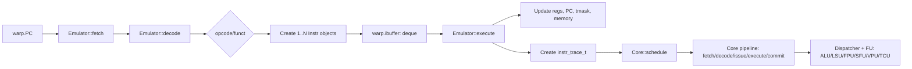

# Vortex CModel (`sim/simx`) RISC-V Instruction Organization

## 1. End-to-End Path

In `sim/simx`, one ISA instruction is handled by two layers:

- Semantic layer (`Emulator`): `fetch -> decode -> execute`, updates architectural state directly (registers, PC, thread mask, memory).
- Timing layer (`Core` pipeline): consumes `instr_trace_t`, then models structural hazards, latency, throughput, and counters via `schedule/fetch/decode/issue/execute/commit`.



## 2. Internal IR Organization

- ISA decode bits (`Opcode`, shifts/masks) are defined in `sim/simx/instr.h`.
- Decoded instruction object is unified as `Instr`:
  - `fu_type`
  - `op_type`
  - `args`
  - `src/dst` register operands
- `OpType` and `IntrArgs` are `std::variant` types in `sim/simx/types.h`.

So decode does not execute semantics directly. It first converts machine code into a unified internal IR.

## 3. Opcode Mapping in `decode.cpp`

`Emulator::decode()` in `sim/simx/decode.cpp` maps `opcode/funct*` to internal `Instr` objects:

| ISA opcode branch | Internal `OpType` | `FUType` | Notes |
|---|---|---|---|
| `LUI/AUIPC` | `AluType::{LUI,AUIPC}` | `ALU` | U-type |
| `R/I/R_W/I_W` | `AluType` or `MdvType` or `AluType::CZERO` | `ALU` | Includes RV32M/RV64W |
| `B/JAL/JALR` | `BrType::{BR,JAL,JALR}` | `ALU` | Control flow |
| `L/FL/S/FS` | `LsuType::{LOAD,STORE}` | `LSU` | Scalar memory path |
| `L/FL/S/FS` (vector path) | `VlsType::{VL,VLS,VLX,VS,VSS,VSX}` | `LSU` | Under `EXT_V_ENABLE`, selected by `mop` |
| `FENCE` | `LsuType::FENCE` | `LSU` | Memory fence |
| `AMO` | `AmoType::*` | `LSU` | Atomic memory ops |
| `SYS` with `funct3!=0` | `CsrType::{CSRRW,CSRRS,CSRRC}` | `SFU` | CSR ops |
| `SYS` with `funct3==0` | `BrType::SYS` | `ALU` | `ECALL/EBREAK/*RET` |
| `FCI` + `FMADD/FMSUB/FNMADD/FNMSUB` | `FpuType::*` | `FPU` | Scalar floating-point |
| `VSET` | `VsetType/VopType` | `VPU` | Under `EXT_V_ENABLE` |
| `EXT1` + `funct7=0` | `WctlType::*` | `SFU` | Warp control |
| `EXT1` + `funct7=1` | `VoteType::*` / `ShflType::*` | `ALU` | Vote and shuffle |
| `EXT2` (`0x2B` / custom-1) | `TcuType::TMEM_*` / `CPABULK_TENSOR_*` | `TCU` | tcgen05 TMEM management + cp.async.bulk.tensor (see §8.1) |
| `EXT3` (`0x5B` / custom-2) | `TcuType::MBAR_*` | `TCU` | tcgen05 sync + full mbarrier family (see §8.2) |
| `EXT4` (`0x7B` / custom-3) | `TcuType::TCU_MMA` / `TCU_LD` / `TCU_ST` / `TCU_WAIT_*` | `TCU` | tcgen05 compute family (see §8.3) |

Note: under the new tcgen05-aligned ISA, all TCU instructions live in EXT2/EXT3/EXT4. EXT1.funct7={2,3,4} no longer dispatches.

## 4. WMMA (TCU) Micro-Op Expansion

Under `EXT_TCU_ENABLE`, `EXT1.WMMA` is expanded from one ISA instruction into multiple TCU micro-ops:

- `fmt_d` is taken from `rd`, `fmt_s` from `rs1`.
- `wmma_config_t` in `sim/common/tensor_cfg.h` determines `m_steps/n_steps/k_steps`.
- Decoder loops over `k/m/n` and emits many `Instr(FUType::TCU, OpType=TcuType::WMMA)`.
- Each micro-op carries `IntrTcuArgs{fmt_s, fmt_d, step_m, step_n}` and mapped A/B/C fragment registers.
- Execute stage calls `tensor_unit_->wmma(...)`.

```mermaid
flowchart TB
  A[EXT1.WMMA machine instruction] --> B[decode: EXT1, funct7=2, funct3=0]
  B --> C[Read fmt_s from rs1, fmt_d from rd]
  C --> D[Loop over k/m/n using wmma_config_t]
  D --> E[Emit many Instr: FU=TCU, OP=WMMA, step_m/step_n]
  E --> F[Push into warp.ibuffer]
  F --> G[Emulator::execute]
  G --> H[tensor_unit_->wmma(...)]
```

## 5. Warp-Level `ibuffer` Behavior

Each `warp_t` contains `std::deque<Instr::Ptr> ibuffer` in `sim/simx/emulator.h`:

- If `ibuffer` is empty: `step()` performs `fetch + decode`, pushes 1..N internal instructions.
- If `ibuffer` is not empty: `step()` keeps executing pending micro-ops from the queue.

This queue is the core mechanism for handling instructions that expand into multiple internal steps (for example WMMA and vector operations).

## 6. Build-Time Feature Gates

- `EXT_V_ENABLE`: enables vector decode and VPU sources.
- `EXT_TCU_ENABLE`: enables WMMA decode, TCU types, and `tensor_unit.cpp`.
- `sim/simx/Makefile` uses `CONFIGS` to inject these macros and include the corresponding source files.

## 7. Key Source Files

- `sim/simx/instr.h`: ISA opcode and decode bit fields, `Instr` definition.
- `sim/simx/types.h`: `FUType`, `OpType`, `IntrArgs`, and per-op argument structs.
- `sim/simx/decode.cpp`: machine code to internal `Instr` mapping.
- `sim/simx/emulator.cpp`: `step()/fetch()/decode()/execute()` semantic flow.
- `sim/simx/execute.cpp`: `visit_var(op_type)` semantic execution and architectural writeback.
- `sim/simx/core.cpp`: timing pipeline, scoreboard, dispatch and commit.
- `sim/simx/tensor_unit.cpp`: TCU WMMA behavior.
- `sim/common/tensor_cfg.h`: `wmma_config_t` parameter derivation for tile/step mapping.

## 8. tcgen05 PTX-Aligned ISA Encoding

R-Type field layout (all three custom opcodes):

```
[31:25]  funct7 = qualifier (modifier bits — PTX `.suffix` flags)
[24:20]  rs2
[19:15]  rs1
[14:12]  funct3 (instruction selector within group)
[11:7]   rd
[6:0]    opcode (EXT2 / EXT3 / EXT4)
```

### 8.1 custom-1 (EXT2, `0x2B`): tcgen05 TMEM management + cp.async.bulk.tensor

| funct3 | name | PTX |
|---|---|---|
| `001` | `TMEM_REL_PERMIT` | `tcgen05.relinquish_alloc_permit` |
| `010` | `TMEM_ALLOC` | `tcgen05.alloc` |
| `011` | `TMEM_DEALLOC` | `tcgen05.dealloc` |
| `100` | `TMEM_CP` | `tcgen05.cp` |
| `101` | `TMEM_SHIFT` | `tcgen05.shift.down` |
| `110` | `CPABULK_TENSOR_LD` | `cp.async.bulk.tensor` (G→S) |
| `111` | `CPABULK_TENSOR_ST` | `cp.async.bulk.tensor` (S→G) |

qualifier semantics: `[0]`=cta_group; for TMEM_CP: `[3:1]`=shape, `[5:4]`=decompress, `[6]`=multicast; for CPABULK: `[2:0]`=dim_count-1, `[3]`=im2col/tile, `[4]`=multicast::cluster, `[5]`=mbarrier::complete_tx (LD only).

### 8.2 custom-2 (EXT3, `0x5B`): tcgen05 sync + mbarrier

| funct3 | name | PTX |
|---|---|---|
| `000` | `MBAR_FENCE` | `tcgen05.fence::{before,after}_thread_sync` |
| `001` | `MBAR_COMMIT` | `tcgen05.commit` |
| `010` | `MBAR_INIT` (or `INVALIDATE` via qualifier[0]) | `mbarrier.init` / `mbarrier.invalidate` |
| `011` | `MBAR_ARRIVE` | `mbarrier.arrive{.expect_tx,.arrive_drop}` |
| `100` | `MBAR_EXPECT_TX` | `mbarrier.expect_tx` |
| `101` | `MBAR_COMPLETE_TX` | `mbarrier.complete_tx` |
| `110` | `MBAR_WAIT` | `mbarrier.wait` (blocking, no timeout) |
| `111` | `MBAR_TEST_TRY_WAIT` | `mbarrier.test_wait` / `mbarrier.try_wait` |

`MBAR_TEST_TRY_WAIT` qualifier: `[0]`=test(0)/try(1), `[1]`=cluster_scope, `[6:2]`=timeout_bucket (5 bits, only for try_wait). `MBAR_ARRIVE` qualifier: `[0]`=cluster_scope, `[1]`=arrive_drop, `[2]`=relaxed, `[3]`=expect_tx_combo.

### 8.3 custom-3 (EXT4, `0x7B`): tcgen05 compute family

| funct3 | name | PTX |
|---|---|---|
| `000` | `TCU_MMA` | `tcgen05.mma{.ws,.sp}` |
| `001` | `TCU_LD` | `tcgen05.ld` |
| `010` | `TCU_ST` | `tcgen05.st` |
| `011` | `TCU_WAIT_LD` | `tcgen05.wait::ld` |
| `100` | `TCU_WAIT_ST` | `tcgen05.wait::st` |

`TCU_MMA` qualifier: `[0]`=enable_input_d (accumulate D), `[1]`=ws, `[2]`=sp, `[3]`=collector_a_fill, `[5:4]`=cta_group, `[6]`=multicast::cluster. The MMA shape/precision/sparsity descriptor (idesc) is loaded lazily by TensorUnit from a memory pointer in rs1 (or from the cached descriptor table, when used via the legacy TC_SET_DESC compatibility path during Phase-1 transition).

### 8.4 Removed instructions

The following Vortex-private macros were removed in this revision because they have no NVIDIA tcgen05 PTX equivalent:

- `WMMA` (legacy synchronous compute) — replaced by `TCU_MMA` async fan-out
- `MMA_LOAD`, `MMA_STORE` — internal microarchitecture, no longer ISA-visible (driven implicitly by TCU_MMA)
- `TC_SET_DESC` — replaced by lazy idesc load inside TCU_MMA
- `TMA_LOAD`, `TMA_STORE`, `TMA_WAIT` — replaced by the strict 2-step (`CPABULK_TENSOR_LD` + `TMEM_CP`) PTX flow

These names persist in `enum class TcuType` as **internal-only routing tags** (TMA_LOAD, MMA_LOAD, WMMA, TC_SET_DESC, etc.) used between `execute.cpp` and the legacy TensorUnit microarchitecture during Phase 1. The kernel ISA layer (`vx_tensor.h` + `decode.cpp`) never produces them.
